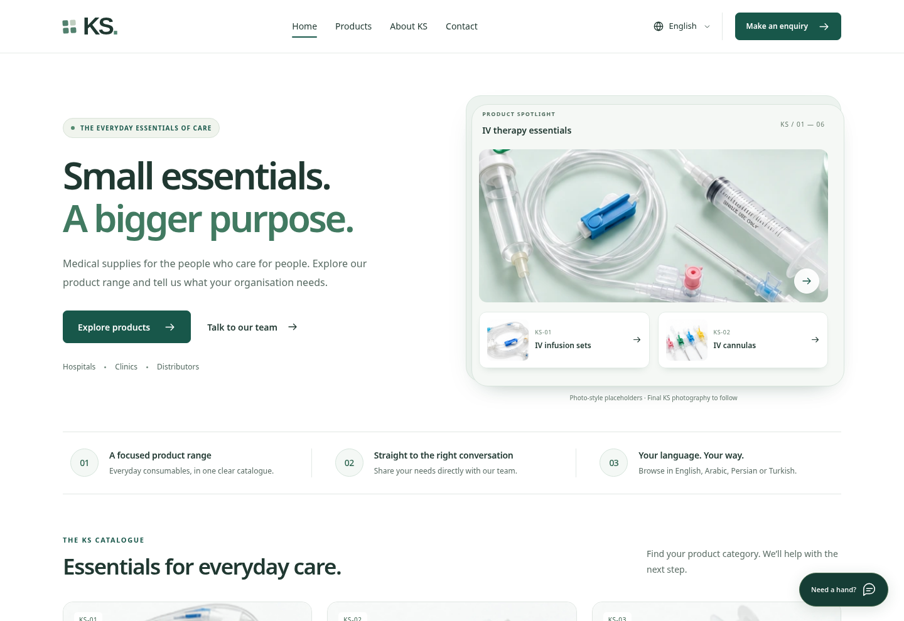

# KS — medical supplies website

**A multilingual, enquiry-led product catalogue. No cart. No checkout.**

This is the complete editable source project for the latest KS website: photographic-style product placeholders, restrained 3D-style depth, product pages, search, contact-form validation and a local support chatbot.

**Start with [START-HERE.md](START-HERE.md)** to upload the project to GitHub and choose a publishing route.



## What you are uploading

This repository contains source files, product images, translations, build tools, tests and deployment configuration. **There is no hand-edited `index.html` at the repository root.** The build generates the complete static website in `dist/`. Do not publish the source directory as the website.

Generated files (`dist/` and `preview.html`) are intentionally ignored by Git; they are reproduced by the build. No runtime npm dependencies, font files, credentials, customer enquiries or live account configuration are bundled.

## Quick start

Use Node.js 22 or newer. The repository's `.nvmrc` selects Node 22. No packages are required to build or run the site. `npm ci` is optional locally and is included in CI to verify the lockfile.

```sh
npm run dev
```

Open the local address printed in the terminal. Changes to source require another build; the small development server does not provide hot reload or email delivery.

```sh
npm run build     # Generate the static pages in dist/
npm run preview   # Serve the current build
npm run portable  # Generate preview.html after building (open it without a server)
npm run check     # Safe preview build + portable build + automated tests + link verification
```

`npm run check` ignores local configuration and intentionally overwrites `dist/` with a non-indexable, email-disabled test build. Run `npm run build` afterwards to regenerate your configured production build.

## Publishing

### Store the project on GitHub

Create a repository and upload **the contents of this folder**, including `.github/`, to its root. `README.md`, `package.json`, `src/`, and `.github/` should be at the top level. Uploading the ZIP itself will not unpack or publish the site. A walkthrough and Git commands are in [START-HERE.md](START-HERE.md).

The `Validate website` workflow builds and tests changes. It does not publish a website or send email.

### Live KS business website: GitHub + Cloudflare Pages

Keep the source on GitHub and connect that repository to Cloudflare Pages. The included contact function is written for that platform.

| Setting | Value |
|---|---|
| Framework preset | None |
| Production branch | `main` |
| Repository/root directory | Root; leave blank |
| Build command | `npm run build` |
| Build output directory | `dist` |
| Node build environment | `NODE_VERSION=22` |
| Base path | Empty |

Connect through Git integration so both the static build and the sibling `functions/` directory are included. Configure the real domain and email services separately; see [docs/DEPLOYMENT.md](docs/DEPLOYMENT.md).

Cloudflare documents Git-connected builds and automatic deployments here: `https://developers.cloudflare.com/pages/get-started/git-integration/`.

### Optional GitHub Pages preview

A manually enabled workflow, `.github/workflows/pages-preview.yml`, builds and deploys the static review site. It reads the real Pages URL and automatically handles both a repository prefix (for example `/ks-medical-website/`) and a domain-root URL. It does not upload the source, tests or server-side handler as part of the website.

Enable **Settings → Pages → Source: GitHub Actions**, then run **Actions → Deploy GitHub Pages preview → Run workflow**. Optionally set the repository variable `ENABLE_PAGES_PREVIEW=true` to enable deployment on later pushes to `main`. The workflow remains inactive on pushes until you opt in.

**Hosting policy:** GitHub Pages restricts use for running an online business or sites primarily facilitating commercial transactions. Do not assume that removing checkout makes the live KS enquiry site eligible. This workflow is an optional review tool, not a recommendation to host the live commercial website there; review the policy for the actual intended use. Use GitHub as the source repository with an appropriate business host for launch.

Official references: `https://docs.github.com/en/pages/getting-started-with-github-pages/github-pages-limits` and `https://docs.github.com/en/pages/getting-started-with-github-pages/using-custom-workflows-with-github-pages`.

## Website features

| Area | Included |
|---|---|
| Pages | Home, catalogue, six product detail pages, About KS, Contact, privacy draft and an English 404 |
| Locales | English, Arabic, Persian and Turkish; 44 localized HTML pages |
| Direction | Arabic and Persian use RTL; product photos and the KS wordmark are not mirrored |
| Product discovery | Text search, category filters, enlarged-image dialogs and product-specific enquiry links |
| Contact | Localized validation, consent, preserved form data during language changes and an explicit unconnected state |
| Support | Local, rule-based catalogue chatbot; no external AI service or live agent |
| Motion | Pointer-responsive CSS perspective, layered photo panels and reduced-motion support |
| Visuals | Deep green, white and restrained sage; seven local WebP photographic-style placeholders |
| Navigation | Main header and persistent language selector; the announcement strip remains removed |

The chatbot does not confirm stock, prices, specifications or clinical instructions. CSS perspective adds depth to two-dimensional images; there is no rotatable 3D product model.

## Source map

```text
.github/
  workflows/ci.yml            Build and test on GitHub
  workflows/pages-preview.yml Optional, opt-in Pages deployment
  dependabot.yml             Proposed GitHub Actions maintenance updates
src/
  catalog.mjs                Product IDs, references and languages
  paths.mjs                  Base-path-safe URL helpers
  locales/{en,ar,fa,tr}.json  All translated content
  templates/                 Shared shell, navigation and page templates
  assets/
    styles.css               Design, responsive/RTL layout and animation
    app.js                   Forms, filters, chatbot and depth interactions
    images/*.webp            Replaceable photographic-style assets
scripts/                     Build, local server, portable preview and verification
functions/api/contact.js     Optional Cloudflare Pages email function
public/_headers              Cloudflare static security-header defaults
.env.example                 Empty configuration template, safe to commit
wrangler.jsonc               Cloudflare Pages project configuration
package.json                 Commands; no application dependencies
package-lock.json            Committed reproducibility metadata
.nvmrc                       Node major version used in CI
README.md / START-HERE.md     Handoff and publishing instructions
docs/                        Deployment, imagery, launch checklist and test evidence
tests/                       Node tests and optional browser checks
```

## Configuration

Copy `.env.example` to `.env` for local builds, or set the values in the hosting platform. Existing process/host environment values take precedence. Real `.env` and `.dev.vars` files are ignored by Git.

| Public build setting | Default / meaning |
|---|---|
| `SITE_URL` | Empty. Set the actual HTTPS site URL; a repository path is supported |
| `BASE_PATH` | Empty for a domain root; `/ks-medical-website` for a repository path |
| `INDEXABLE` | `false`; only set `true` after content and launch approval |
| `CONTACT_ENABLED` | `false`; requires a compatible backend and public security-check key |
| `PUBLIC_TURNSTILE_SITE_KEY` | Empty; never put a secret here |

A supplied `SITE_URL` alone does **not** enable indexing. Canonical/alternate links and a sitemap can be generated while the site remains a review build. GitHub Pages preview always disables indexing and email. A `robots.txt` file under a repository subpath is not an origin-wide crawler rule; the per-page `noindex` metadata is the relevant preview directive.

The live email function expects a domain-root deployment. It intentionally does not accept public recipient overrides or wildcard cross-origin submissions. See [docs/DEPLOYMENT.md](docs/DEPLOYMENT.md) for server-side secrets and test requirements.

## Edit products, images and languages

Product IDs and references live in `src/catalog.mjs`. Text lives in the four JSON locale files. All four dictionaries must retain matching keys. To add a category, also update the contact handler allowlist, chatbot matching and relevant tests.

Replace the seven images in `src/assets/images/`, retaining the filenames, then rebuild. The same file is reused on every relevant page and language. Update image dimensions in templates when changing aspect ratios. Details are in [docs/IMAGE-ASSETS.md](docs/IMAGE-ASSETS.md).

**Current images are AI-generated photographic-style placeholders, not photographs of verified KS stock.** They must not be used as evidence of product construction, capacity, materials, labeling or approval. The site visibly identifies them as placeholders. Remove those disclosures only once approved KS photography replaces them.

The configured Google Fonts families are Manrope, Noto Sans and Noto Sans Arabic. Font files are not bundled; system fallbacks work without the external font connection. The privacy draft discloses that connection.

## Readiness and remaining setup

The visual/interactive implementation and repository packaging are complete for review. The project has not been pushed to your GitHub account, publicly deployed or connected to an inbox.

Before launch, confirm the final legal business details, contact channels, supplied product specifications, photographs, market eligibility and translated copy. Finalize the privacy notice. Configure the actual email receiver, verified sender, security-check service and rate limits. Complete the [launch checklist](docs/LAUNCH-CHECKLIST.md).

There are no invented prices, lead times, certificates or stock promises. `KS-01` to `KS-06` are internal catalogue references, not verified manufacturer model numbers. Arabic serves the requested Iraqi and UAE audiences in this version; Kurdish is not included.

## Tests and limitations

The handoff passed **26 Node tests and 41 targeted Chromium checks**. The Node checks include a local HTTP server at `/` and `/ks-medical-website/`; every one of the 44 localized pages loads at both prefixes, and the images, MIME types, redirects and 404 paths are checked. Each full build has 46 HTML files and 1,720 local references. The browser suite covers the portable edition and 160 viewport/language/page combinations.

These are targeted checks, not a full accessibility or security audit. Google Fonts was blocked in the test environment, so browser screenshots use fallback fonts. Direct browser URL navigation was also restricted in that environment; the HTTP checks use Node's HTTP client, while the browser interaction tests load the portable HTML. The additional `tests/hosted-check.py` is provided for a developer to run on an unrestricted local machine; it is not claimed as a completed handoff test.

Provider behavior is mocked in contact-handler tests. Live delivery, Turnstile credentials, Safari/iOS, assistive technologies and the eventual public hostname still need acceptance testing. See [docs/QA.md](docs/QA.md).

## Licensing and assets

No open-source license has been chosen for this business project. `package.json` is marked `UNLICENSED`; decide deliberately before granting public reuse rights. See [NOTICE.md](NOTICE.md) for the asset and configuration notes.
